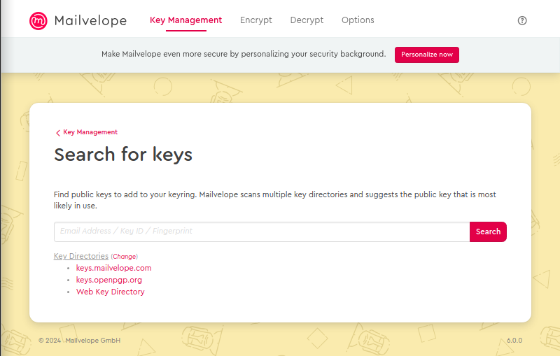

# Práctica 3a. GPG Pretty Good Privacy

## Contexto
El término criptografía proviene del griego *kyptós* 'oculto' y *grafé* 'escritura' y es definida como el arte de escribir con clave secreta o de un modo enigmático.

Gracias al uso de la criptografía se puede obtener una seria de ventajas de gran utilidad en el ámbito de la seguridad informáticfa como son:
* Confidencialidad
* Integridad
* Autenticidad
* No repudio
    

En esta práctica se trabajará sobre estos cuatro conceptos mediante la herramienta de comandos gpg (Pretty Good Privacy)

## Objetivos
* Entender la *confidencialidad, Integridad, Autenticidad* y no repudio mediante el uso de la herramienta *gpg*.
* Entender y poner en práctica la criptografía simetrica
* Entender y poner el práctica la criptografía asimétrcia
* Saber cifrar y descifrar mensajes mediante criptografía simétrica.
* Saber cifrar y descifrar mensajes mediante criptografía asimétrica.
* Saber firmar otras llaves generando así una relación de confianza entre usuarios de la comunidad.
* Ser capaces de firmar un documento y verificar que este ha sido firmado por quien dice ser.
* Ser capaces de importar/exportar claves a un servidor público
* Saber enviar correos cifrados y descifrar correos privados

## Desarrollo

1. **Cifrar y descifrar un mensaje mediante criptografía simétrica**
Para poder cifrar un mensaje haciendo uso de la criptografía simétrica, hay que generar claves (y enviarla a el receptor de la transmision).
```bash
 gpg –full-gen-key
```
Ahora que estan creadas vamos a cifrar el mensaje (que esta contenido en el archivo mensaje.txt)
```bash
gpg --batch --passphrase jorge --symmetric --armor --output mensaje.text.asc mensaje.txt
```
El mensaje cifrado es este: 
```
----BEGIN PGP MESSAGE-----

jA0ECQMCnQmtBsGDqZD/0lIBp0vlDcTlRAXRKiHvQcartUrqlUqgoPUQv6qmRLCe
RlO8Wo0bvgSdlQJLE0z324IDy9gCDfn0RTXNNA8wn6/fw3NRY3yn00UaUtvEo428
fI6W
=7fEz
-----END PGP MESSAGE-----
```

Si  queremos descifrarlo necesitamos tener la clave simetrica con la que se encripto. Ya que solo se peude cifrar y descifrar con esta clave. (pedira la passphrase que es "jorge")
``` bash
gpg --decrypt mensaje.txt.asc 
   gpg: AES256.CFB encrypted data
   gpg: encrypted with 1 passphrase
   Holaeste es un mensaje

```

2. **Crear par de claves**
Cuando hablaos de crear un par de claves se refiere a claves asimetricas. Esto se hace mediante el comadno anterior. (gpg --full-ky-gen) 

3. **Listar claves pública/privada**
Podemos comprobar que se han creado el par de claves con el comando:
```bash
gpg --list-public-keys
   /home/vagrant/.gnupg/pubring.kbx
   --------------------------------
   pub   rsa3072 2024-12-02 [SC]
         EB9A55B9777112A7C1203425E4D5D899C3796DE6
   uid           [ultimate] Jorge <jorge@jorge.org>
   sub   rsa3072 2024-12-02 [E]


gpg --list-secret-keys 
   /home/vagrant/.gnupg/pubring.kbx
   --------------------------------
   sec   rsa3072 2024-12-02 [SC]
         EB9A55B9777112A7C1203425E4D5D899C3796DE6
   uid           [ultimate] Jorge <jorge@jorge.org>
   ssb   rsa3072 2024-12-02 [E]
```

4. **Importar/exportar claves publicas y privadas**
Para importar una clave se usa el comando:
```bash
gpg --import clave-ajena.txt
```
Para exportarla:
```bash
gpg --export --armour jorge
```

5. **Importar y exportar de un servidor de claves**
Para importar primero hay que encontrar las claves, para lo que se usa el comando:
```bash
gpg --keyserver keyserver.ubuntu.com --search-keys arnbalmas
```
Ahora que sabemios cual es podemos bajarla desde el servidor con el comando:
```bash
gpg --keyserver keyserver.ubuntu.com --receive-keys 311FF2DF
```
Y luego importarla con el coamndo anterirormente visto.

Para exportar una clave, hay que subirla al servidor.
```bash
gpg --keyserver keyserver.ubuntu.com –send-keys EB9A55B9777112A7C1203425E4D5D899C3796DE6
```
El id que escribimos l opodemos conocer gracias al comando --list-keys

6. **Encriptar un documento con clave pública de destinatario**
Para hacer esto eves conocer el nombre del destinatario. En este caso el destinatario es notario-sad@iesgrao.es.
```bash
pg --armour --encrypt --recipient notario-sad@iesgrao.es mensaje.txt
```
7. **Desencriptar un documento cifrado con nuetra clave publica haciendo uso de clave privada**
Se usa la misma opcion de decrypt.

8. **Firmar un mensaje y verificar la autoria de un mensaje**
Hay varias formas de hcer esto.
Para firmar un documento con tu clave privada sin encriptar es:
```bash
gpg --clear-sign mensaje.txt 
```
Para verificarlo sera:
```bash
gpg --verify mensaje.txt.asc 
```
Para que la firma este separada deldocumento firmado:
```bash
gpg --detach-sign mensaje.txt
```
9.  **Mailevelope**
   1.  Importar clave privada
         Entramos en chorme y buscamos el addon de mailvelope, al añadirlo, podemos ir a la pestaña "Key Mangement". Aqui podemos subir nuestra clave compiadnola de un archvio .asc. 
         Una vez subida quedara podremos ver que esta como "Default"
         

   2.  Subir clave pública al keyserver de mailevelope
         En el apartado "key Management" vamos a clicar en el boton "Import". Aqui podremos copiar directamente el codigo ascii de la clave que queremos añadir.
         
         Tambien podmeos ir al boton "Search" y buscar el nombre de el propietario de la clave o la clavedirectamente para así añadirla (Tienen que estar dentro de una cuenta d emailvelope).
         

   3.  Importar claves publicas
         En el apartado "key Management" vamos a clicar en el boton "Import". Aqui podremos copiar directamente el codigo ascii de la clave que queremos añadir.
         

   4.  Enviar un mensaje cifrado y descifrar mensaje.
         Simplemente vamos a lapartado "Encrypt" selecccioanmos el que lo va ha recibir (par aencriptar con su clave publica).
         Luego podemos arrastrar el archvivo que deseamos encriptar y dejarlo en la caja.
         Clicamos en el boton "Encrypt". Ahora encriptado lo podemos enviar por el medio deseado.
         
         Una vez llegue vamos al apartado "Decrypt" y arrastramso e l archvi cifrado que hemos recvido a la caja. Clicamos en el boton "Decrypt"
         